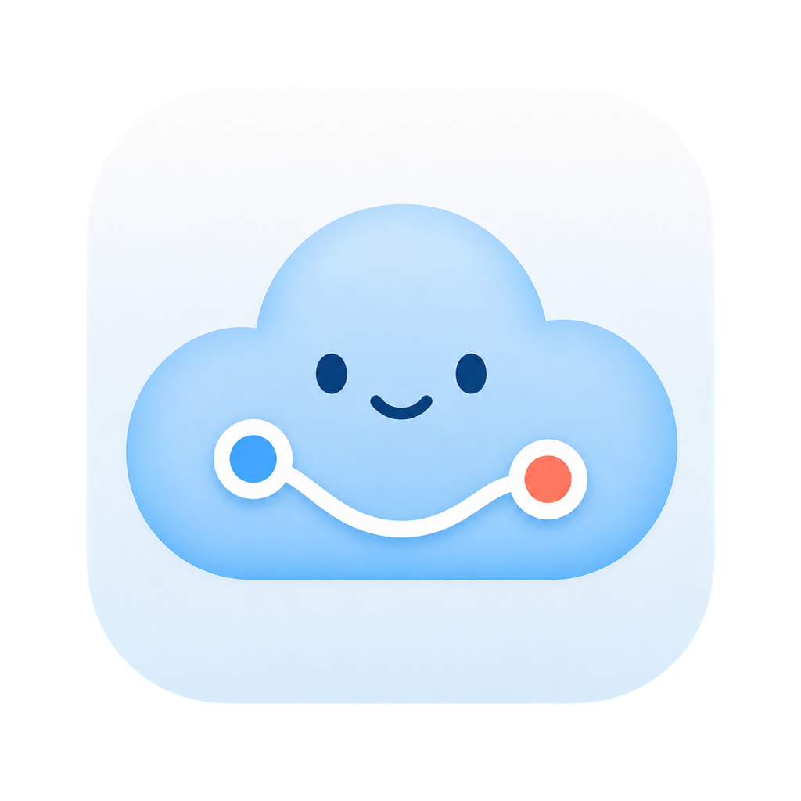

# CloudCheck

<p align="center">
  
</p>

CloudCheck 是一个轻量的原生代理状态面板，支持
macOS 与 Windows。它用来查看
Mihomo/Clash Verge 的核心、混合端口和流量入口状态，并提供结构化链路检测。

## 功能

- macOS 使用 SwiftUI，Windows 使用原生 WPF
- 检测 Mihomo 核心、mixed 端口、系统代理与 TUN 路由
- macOS 首次启动自动识别 Clash Verge Rev / Mihomo 的本地入口与流量模式；检测失败才要求手动填写端口
- 流量入口卡片按实际状态切换：仅系统代理或仅 TUN 显示绿色，两者同时开启显示橙色提示，两者均未开启显示灰色
- 用三个独立查询源交叉验证代理出口，识别出口漂移、分流或透明代理干扰
- TUN 生效时验证 DNS 是否返回 `198.18.x.x` Fake-IP，直接发现域名分流配置缺失
- 分开检查 ASN 归属、IP 段用途、风险标签、AI 站点真实响应和外网连通性
- macOS 提供独立“高级检测”入口，按需打开 BrowserLeaks、IPhey、IPQS、Scamalytics、AbuseIPDB
- 常规链路报告只统计自动检测；高级检测与账户判断不计入通过、提示或失败
- 链路检测运行时显示线性进度，完成后给出可解释的 0–100 链路分
- macOS 默认使用不假定代理拓扑的通用方案；额外出口、策略组和域名规则由用户按需启用
- 原有 Google/Gemini 双出口结构保留为预填模板，可修改名称、策略组、本地入口和目标域名
- macOS 深度复核可分别用默认出口或已启用的额外出口启动临时 Chrome；不复用现有 Cookie、扩展或浏览器资料，也不修改系统代理
- 内置可独立分享的 Clash Verge Rev / Mihomo 规则包，不包含订阅或节点
- macOS 可选用独立 PF anchor 实现防泄漏 Kill Switch
- Windows 版只做只读网络检测，不修改全局防火墙策略
- macOS 链路检测、Kill Switch 脚本和管理员助手均内置于 App Bundle

## 平台支持

| 平台 | 状态面板 | 链路检测 | Kill Switch | 构建产物 |
|---|---:|---:|---:|---|
| macOS 26（Apple Silicon） | ✓ | ✓ | PF anchor（可选） | `CloudCheck.app` |
| Windows 10/11 x64 | ✓ | ✓ | 暂不提供 | 单文件 `CloudCheck.exe` |
| Windows 11 ARM64 | ✓ | ✓ | 暂不提供 | 单文件 `CloudCheck.exe` |

## 规则包与订阅

CloudCheck 把两者有意分开：

- **订阅**由使用者自己的代理客户端管理，CloudCheck 不读取、不保存也不分发订阅地址、
  节点或凭据。
- **规则包**位于 [`Rules/CloudCheck-Merge.yaml`](Rules/CloudCheck-Merge.yaml)，随 macOS
  App 与 Windows 单文件程序一起打包，可从主界面底部“规则管理”入口预览、复制或导出。

规则包使用 Clash Verge Rev 的 `prepend-rules`，确保 AI 与开发站点规则排在订阅自带的
`GEOIP` / `MATCH` 规则之前，同时包含 TUN 所需的 Fake-IP DNS 配置。默认策略组名是
`PROXY`；如果朋友的订阅使用其他组名，导入前替换规则最后一列即可。导出后在 Clash
Verge Rev 中新建并启用 `Merge` 配置，再刷新当前订阅。这样规则可以共享，订阅仍由每个
人独立选择。

## macOS

### 系统要求

- 最新版 macOS 26，Apple Silicon Mac
- 使用 Mihomo 核心的代理客户端（默认进程名 `verge-mihomo`）
- 默认 mixed 端口：`127.0.0.1:7890`

### 构建

构建需要 Xcode Command Line Tools；仅运行预编译版本不需要。

```bash
chmod +x Scripts/*.sh
Scripts/build.sh
Scripts/package-macos.sh
open "build/CloudCheck.app"
```

构建结果位于 `build/CloudCheck.app`，分享包位于
`dist/CloudCheck-<版本>-macOS-arm64.zip`。应用采用 ad-hoc 签名，尚未使用 Developer ID
签名或 Apple 公证。

### 分享预编译版本

推荐从 GitHub Releases 分享三个按版本命名的 ZIP，而不是分享源码或 `Scripts/` 目录：

- `CloudCheck-<版本>-macOS-arm64.zip`
- `CloudCheck-<版本>-win-x64.zip`
- `CloudCheck-<版本>-win-arm64.zip`

当前 GitHub 仓库是私有仓库：只有仓库协作者能直接下载 Release。分享给非协作者时，由维护
者先下载对应 ZIP 和 `SHA256SUMS.txt`，再通过可信文件传输渠道发送；不要为了方便下载就
直接把仓库改成公开。

Mac 用户解压后把 `CloudCheck.app` 移到“应用程序”即可；正常图形功能所需的检查脚本、规则
和管理员助手已包含在 App 内，不需要运行 `install.sh`。由于当前版本没有 Apple 公证，首次
打开可能被 Gatekeeper 拦截；只应在确认下载来源与 `SHA256SUMS.txt` 校验值后，到“系统
设置 → 隐私与安全性”选择“仍要打开”。面向更广泛用户公开分发前，应补齐 Developer ID
签名与公证。

macOS 首次启动会优先从 Mihomo 本地控制 socket、macOS 系统代理和 Clash Verge Rev 根设置
文件中识别当前 mixed 端口，并展示“代理客户端 → 本地入口 → 流量模式”供用户一次确认。
自动检测只提取端口与运行模式，不读取或保存订阅 URL、节点、UUID、密码或密钥；检测失败
时才显示只允许本机回环地址的手动端口输入。确认结果保存在 CloudCheck 自己的 macOS 偏好
中，标题栏的连接设置按钮可以随时重新检测。

分享包不包含代理客户端、订阅、节点、服务器地址或个人配置。朋友仍需自行安装并配置
Mihomo/Clash Verge；PF Kill Switch 也不会随普通分享包自动安装。

### 安装

```bash
Scripts/install.sh
```

默认安装到 `~/Applications/CloudCheck.app`，辅助脚本安装到：

- `~/.local/bin/cloudcheck-check`
- `~/.local/bin/cloudcheck-ip-risk.jxa`
- `~/.local/bin/cloudcheck-chain-check.jxa`
- `~/.local/bin/cloudcheck-private-browser`
- `~/.local/bin/cloudcheck-killswitch`
- `~/.local/share/cloudcheck/`

这些外部脚本用于命令行调用和旧版兼容；图形应用正常运行会优先使用 App Bundle
内置副本，因此单独移动 `CloudCheck.app` 不会丢失链路检测或管理员助手。

### 配置

普通 macOS 图形用户不需要创建配置文件；首次引导确认的本地入口会直接传给 App 内置脚本。
下面的文件仅用于开发者命令行、高级链式出口和 PF Kill Switch 配置；运行安装脚本时会创建：

```text
~/.config/cloudcheck/config
```

主要配置项：

```bash
CLOUDCHECK_MIXED="127.0.0.1:7890"
CLOUDCHECK_EXPECT_IP=""  # 可选：校验准确的代理出口 IP
CLOUDCHECK_SECONDARY_ENABLED="0"  # 普通单出口保持关闭
CLOUDCHECK_SECONDARY_LABEL="Google / Gemini"  # 预填模板，可改名
CLOUDCHECK_SECONDARY_GROUP="Google-Chain"
CLOUDCHECK_DEFAULT_GROUP="PROXY"
CLOUDCHECK_SECONDARY_MIXED="127.0.0.1:7891"
CLOUDCHECK_SECONDARY_DOMAINS="gemini.google.com,generativelanguage.googleapis.com,www.google.com"
CLOUDCHECK_EXPECT_SECONDARY_IP=""  # 可选：校验额外出口基线
CLOUDCHECK_CHROME="/Applications/Google Chrome.app/Contents/MacOS/Google Chrome"
CLOUDCHECK_ACTIVE_AI_PROBES="0"  # 默认关闭：不主动请求任何 AI 平台
CLOUDCHECK_VPS_IP=""     # 仅 PF Kill Switch 需要
```

从 CloudLinkGuard、CloudRoute 或 PuffRoute 升级时，安装脚本会在新配置不存在的情况下
依次复制 `~/.config/cloudlink-guard/config`、`~/.config/cloudroute/config` 或
`~/.config/puffroute/config`。运行时也会读取旧的 `CLOUDLINK_GUARD_*`、
`CLOUDROUTE_*` 和 `PUFFROUTE_*` 变量。新旧配置同时存在时，以 CloudCheck 配置和
`CLOUDCHECK_*` 变量为准。三代旧命令名只作为指向 `cloudcheck-*` 的兼容符号链接。

新安装只使用 `com.valenlan.cloudcheck`、`CloudCheck` 和 `cloudcheck` 主标识。旧的
`com.valenlan.cloudlinkguard`、`CloudLinkGuard`、`cloudlink-guard`、CloudRoute 与 PuffRoute
仅保留在迁移逻辑中，读取成功后会写入 CloudCheck 的新位置。

仓库不包含任何真实服务器地址或个人配置。

如果启用了独立链式出口，仅检查策略组和规则命中还不够。当前预填模板使用
[`Rules/CloudCheck-Google-Chain-Probe.yaml`](Rules/CloudCheck-Google-Chain-Probe.yaml)
中的 `listeners` 合并到 Mihomo 活动配置后，CloudCheck 会通过只监听
`127.0.0.1:7891` 的专用 mixed 入口查询实际出口，并在报告中并排显示默认出口与
额外出口。该示例入口固定绑定 `Google-Chain`，不会临时切换策略组，也不会暴露到局域网；
其他用户可以在“链路检测 → 方案”中替换成自己的策略组、端口和域名。

### 可选：PF Kill Switch

> PF 配置会影响整台 Mac 的联网行为。请先阅读脚本和规则，并确保你有可恢复的
> 本地终端访问。配置错误可能导致暂时断网。

填写 `CLOUDCHECK_VPS_IP` 后运行：

```bash
Scripts/install-pf.sh
```

该脚本会：

1. 生成 `/etc/pf.anchors/cloudcheck`
2. 在当前 `/etc/pf.conf` 中注册 `anchor "cloudcheck"`
3. 先运行 PF 语法检查，再安装配置
4. 首次执行时备份 `/etc/pf.conf.cloudcheck.bak`

安装规则后，可在 CloudCheck 界面中开启或关闭 Kill Switch。

从 CloudLinkGuard、CloudRoute、PuffRoute 或更早的 Proxy Tools 升级时，如果系统仍注册
`cloudlink-guard`、`cloudroute`、`puffroute` 或 `killswitch` anchor，CloudCheck 会继续调用
原有规则，避免仅因应用改名而失去保护。`install-pf.sh` 会复用已有的三代旧 anchor，
避免同时启用两套
PF 规则；遇到更早的 `killswitch` anchor 时会拒绝自动叠加。全新安装使用
`cloudcheck` anchor。

## Windows

Windows 版位于 [`Windows/`](Windows/)，使用 .NET 8 WPF，不依赖第三方 UI 框架。

### 使用预编译版本

1. 仓库协作者在 GitHub Releases 下载 `CloudCheck-<版本>-win-x64.zip`；ARM Windows 下载
   `CloudCheck-<版本>-win-arm64.zip`。非协作者使用维护者转发的同一 ZIP
2. 解压后运行 `CloudCheck.exe`
3. 点击标题栏的设置按钮，确认 mixed 地址与端口

发布包为 self-contained 单文件程序，朋友的电脑无需预装 .NET。Windows 首次运行
未经代码签名的个人应用时，SmartScreen 可能显示提醒。

### 本地构建

需要 .NET 8 SDK 与 Windows 10/11：

```powershell
dotnet publish Windows/CloudCheck.Windows.csproj `
  --configuration Release `
  --runtime win-x64 `
  --self-contained true `
  -p:PublishSingleFile=true
```

Windows 配置保存在：

```text
%APPDATA%\CloudCheck\config.json
```

首次运行会依次读取并复制旧的 `%APPDATA%\CloudLinkGuard\config.json`、
`%APPDATA%\CloudRoute\config.json` 或 `%APPDATA%\PuffRoute\config.json`，不会删除旧文件。

Windows 版没有照搬 macOS Kill Switch。可靠的 Windows 等价方案需要修改全局
Firewall/WFP 策略，误配置可能让整台电脑断网；当前分享版刻意保持只读。

## 发布

每次 push 与 pull request 都会构建并测试 macOS、Windows x64 和 Windows ARM64，并把
三个 ZIP 原样保存为 Actions artifacts。只有推送与应用版本完全一致的 `v<版本>` 标签时，
工作流才会创建 GitHub Release，同时上传三个 ZIP 与 `SHA256SUMS.txt`。例如当前版本对应的
发布标签应为 `v1.5.0`。

创建标签会产生供仓库授权用户下载的正式发布结果，必须在全部本地测试和普通 push CI
通过后由维护者明确执行；构建脚本本身不会自动创建标签。

## 隐私与安全

- 链路检测会通过已配置的本地代理访问公开 IP 查询服务和测试站点。
- 默认链路检测不会请求 Claude、ChatGPT、Gemini 的网页或 API。启用额外分流模板后，规则
  命中从本机 Mihomo 运行时读取，链路延迟使用中性 204 地址，实际出口通过专用本地入口
  访问公开 IP 查询服务确认。只有用户显式把 `CLOUDCHECK_ACTIVE_AI_PROBES` 设为 `1` 时，
  macOS 才会主动请求三个 AI API；即使启用，也不会自动访问账号网页。
- 出口一致性检查会把默认代理出口分别提交给 `api.ipify.org`、`ifconfig.me` 与 `ip.sb`；
  启用额外出口探针时，也会经该用户设置的本地入口访问同一组服务。只有至少两个
  来源给出一致结果才算完成交叉验证。
- IP 风险画像会把实测出口 IP 提交给 `ipapi.is` 与 `proxycheck.io`，并把查询得到的 ASN
  提交给 `PeeringDB`。启用额外出口探针后，默认出口与额外出口会分别查询、分开展示，
  避免拿默认 IP 的结论评价另一条链路。报告会分别展示网络归属、ASN 属性、
  IP 段用途、风险分与地址风险标签，避免把运营商类型和具体地址用途混为一谈。第三方情报
  仅供参考，接口限流不会被视为代理故障。
- IPQS、Scamalytics、AbuseIPDB、BrowserLeaks 与 IPhey 只作为用户主动点击的复核入口，
  CloudCheck 不会在后台自动访问。BrowserLeaks/IPhey 必须在真实浏览器上下文中运行，才能
  观察 WebRTC、DNS、IPv6、时区和指纹一致性。
- CloudCheck 不读取 Claude、ChatGPT 等网站的登录 Cookie 或账户资料，也不会把账户判断
  塞进常规链路报告。账户状态只能由用户在自己的正常登录会话中确认。
- 链路分只汇总当前检测方案：通用方案按基础五段重新归一化；启用额外分流后才加入策略、
  规则与第二出口权重。提示扣对应部分一半权重，失败扣全部权重；关键入口失败时最高为 49 分。
  它不是网速、匿名性或账户安全评分。
- macOS 的“高级检测”只在用户点击后启动独立 Chrome 进程，且结果不计入链路分。它使用临时资料目录、
  禁用现有扩展与同步，并通过进程专属的本机代理打开 BrowserLeaks、IPhey、IPQS、
  Scamalytics 与 AbuseIPDB；关闭该 Chrome 窗口后删除临时资料。检测网站仍能看到所选
  出口 IP 和浏览器指纹，因此“隔离”不等于对网站匿名。该功能不会改变系统代理，也不会
  影响普通 Chrome 窗口和其他应用的流量。
- CloudCheck 不上传配置，不收集遥测，也不保存浏览记录。
- macOS 管理员权限仅用于读取或修改 CloudCheck 自己的 PF anchor。
- Windows 版不请求管理员权限，也不修改 Windows Firewall。
- 发布前请不要提交 `~/.config/cloudcheck/config`。

## 项目状态

这是一个面向个人 macOS 代理环境的小工具。不同代理客户端、端口和 PF 网络接口
可能需要调整配置。欢迎通过 Issue 报告可复现的问题。
